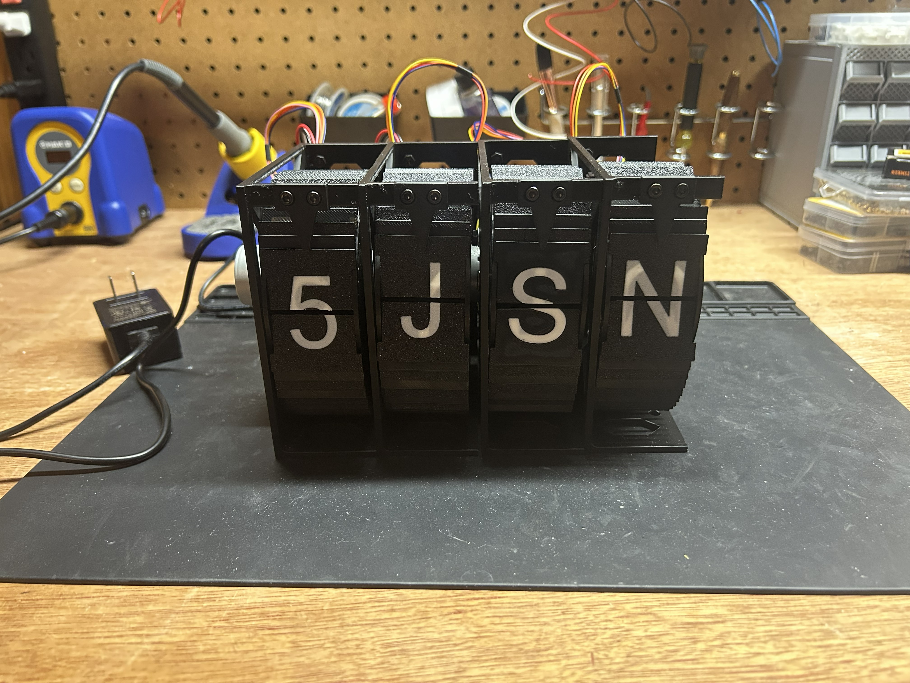
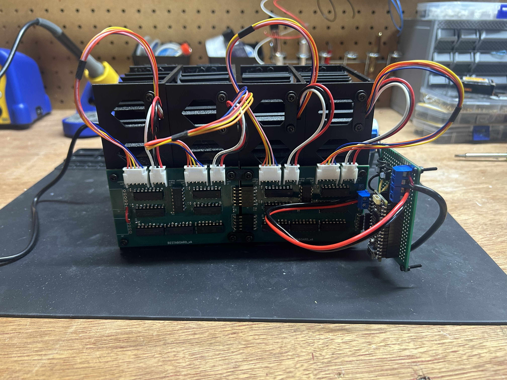
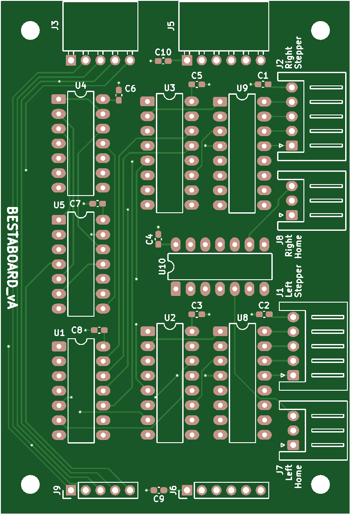

# Bestaboard 

## Overview
Bestaboard is a personal project with the goal of imitating the functionality of the [Vestaboard](https://www.vestaboard.com/) at an affordable price. It is currently at the prototype phase and has displayed the core functionallity sucessfully. Bestaboard was designed with simplicity and modularity in mind. Each display module controls two split flap displays and connects to the following display module directly. A control module connects to the first board. The position of the displays are controlled by stepper motors. Utilizing a shift register on each display module that connects to the following display module's shift register, the control module controls the position data through two signals data and shift. Eight shifts of the data line need to occur for each stepper motor and the data is fed from last character first. A latch follows the shift registers on the PCB, once all the position data has been updated in the shift registers the new data is held onto by the latched by pulsing the strobe signal high.

The control module switches between two states, homing and character. When homing the home signal is held high, signaling all display modules they need to return to home. Home is identified as the location where a blank character is displayed and sensed when a magnet on the rotating drum gets within range of the magnetic sensor on the frame. While homing the control module is continuously attempting to rotate all the stepper motors until the All_Homed signal has been received. Logic gates on the PCB stop the strobe signal when the display has reached home. The All_Homed signal is driven by a chain of AND gates of the current display and the display to the left, when all displays have reached the home position the All_Homed signal goes high. When going to a character the control module calculates how many rotations of the stepper motor need to occur to get to the desired character. 

### Digital Signals
1. Data(O) - Sent in tandem with the Shift signal, position data for the stepper motors.
2. Shift(O) - Send in tandem with the Data signal, shifts the data signal onto the shift register.
3. Strobe(O) - Passes the shift register data to the stepper motors.
4. Home(O) - Indicates homing is taking place, enables hardware strobe gating to stop each display from rotating once it has arrived home.
5. All_Homed(I) - The output of every homed sensor AND'd together, indicating all displays are homed and the homing process can end. 

## Cost Analysis
The Vestaboard has 132 characters. In order to scale the Bestaboard to a similar character total, the cost per character has to be kept low. An incomplete analysis below shows that under 10 dollars may be obtainable. Electronics pricing was selected at the 10 qty mark on Digikey, but increased bulk buying would bring this pricing down further. Things not included are the control module board, framing for connecting the display modules together, screws, etc. Most of these costs are quantity of one and would not have a large impact on the total cost.  

Display Module (Cost Per Character)

- Electronics (0.5): $6.30  
- Printing Material: $1.83
- PCB(shipping not included): $1.30
- Total(per character): $9.43 

Vestaboard (Cost Per Character)
- Vestaboard: $3499
- Characters: 132
- Total(per character): $26.50

## Planned Work 
1. Add Random List of Words
2. (Issue #3) Move the stepper inside of the drum. 
3. (Issue #3) Mount display PCBs on a back wall. 
4. (Issue #3) Mount display modules to a floor.
5. Create a PCB control module. 

## Issues
1. The detection of home is too large, the first character "A" appears as tough the drum is homed. If the protype is powered up at "A", it appears that the display is already homed and will start from that position instead of home. This results in the wrong character being displayed the first time around. The problem has been primarily been mitigated through two software changes. 
	
    1. When homing after going to a character, one character of rotation is guaranteed. This moves any first characters at "A" to the second character "B", which is past the homing sensor and a normal homing can take place. If a display was at the last character this simple forces it to home before starting homing, which then immediately end in the correct location.
	
	2. The home position to drum alignment is near the edge of a character flip. While it should take 85 stepper positions to rotate to the next character, it is less than this and varies from module to modules from mechanical tolerance. This resulted in the wrong character being displayed depending on how the module was assembled. An offset was added in software (controlled by dip switches) to place the modules in the center of the displayed character. This provides a buffer so that all modules display the intended character. 

2. The simplified homing procedure, where all steppers are rotated until all displays are homed but stopped by hardware, allows the stepper position maintained by the controller to get out of synch of the stepper motor. At slow speed this shows up as some displays not rotating for awhile, but isn't noticable at faster speeds. This is a source of error for positioning the display as it can take up to 7 attempted stepper positions before the control module and stepper are synch and rotation starts. There are 85.33 steps between each character and the targeted point is the middle of the displayed character. So in ~42 steps the next character should start being displayed. This error causes the position to be up to -7 steps off, with ~42 steps in each direction to the next character this is a significant source of error. However, the margin appears to handle the error without a problem. A hardware change would have to take place to remove the error, with the error not manifesting itself and the goal of keepings costs low, there isn't a plan to resolve this issue. 

3. When display modules are mounted together, accessing individual components takes excessive disassembly. You have to start on the end of the row and work your way back. This scales very poorly for the long rows that are required. Completing planned work 2-4 will allow any display module to be removed with minimal amount of work, regardless of its position in the row.

## Images

